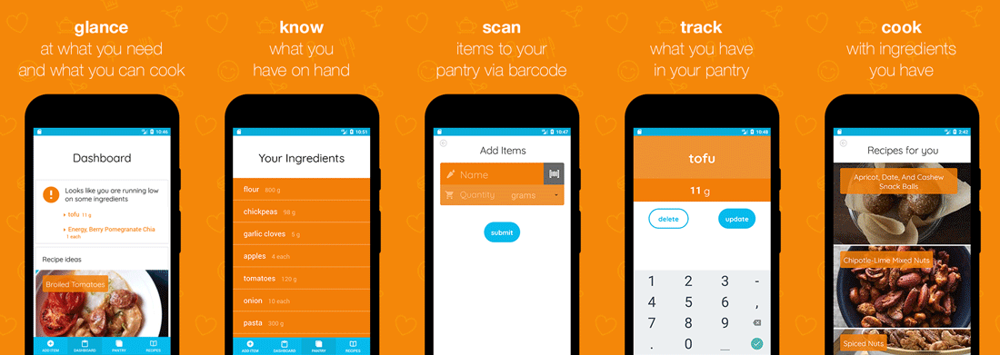
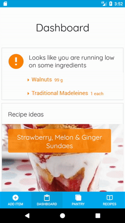
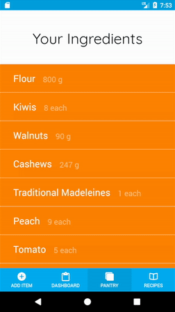

# KitchenFox
[Demo Site](https://kitchenfox.site/)

## Overview
KitchenFox, an Android and iOS mobile app, helps you visualize your kitchen's food inventory and recommends recipes based on the ingredients you have.

Users can keep track of their produce and grocery items by entering items into their invetory via scanning an items barcode scanning tool. They also can manually enter, update, and delete items that have been consumed.

Our team's mission is to help people reduce their food waste by keeping track on inventory items. Cook your favorite ingredients with ease!



### Adding ingredients


### Updating ingredients



## Technologies
  KitchenFox's frontend utilizes React Native with a Redux architecture for efficient and unidirectional data management.
  
  On the backend, it pairs an Express framework for Node.js and MongoDB. MongoDB allows us to build a scalable, high-performance, open source, schema-free, document-oriented database.

  Third Party APIs involved:
   + [Edamam](http://developer.edamam.com/edamam-docs-recipe-api)
      - allows for recipe search using ingredients
   + [Nutritionix](https://developer.nutritionix.com/docs/v1_1#/nutritionix_api_v1_1)
      - fetch food item information with UPC code

## Features
  ### JWT Token Authentication
  + Generating and storing JWT tokens via Async Storage on the local device helped bootstrap the user to the application. Passport.js was utilized to verify the token and also fetch the appropriate user's collection.

  ### Barcode Scanning Tool
  + Integrated the react-native-camera library into the KitchenFox app allowed the user to use their phone's camera to scan an item's barcode to add ingredients into their inventory. 

  ``` javascript

  onBarCodeRead(e) {
    const newItems = Object.assign(this.state.items);
    let newItem;
    this.setState({ showCamera: false });
    upcLookUp(e.data, this.props.session.token).then((res) => {
      newItem = JSON.parse(res._bodyText);
      newItem = newItem[0];
      if (newItem.quantity === 1) {
        newItem.units = 'each';
      }
      this.handleCardUpdate(this.state.camIdx, newItem);
    });
    Alert.alert(
        "Barcode Found!",
        "Type: " + e.type + "\nData: " + e.data
    );
  }

  render() {
    if (this.state.showCamera) {
      return (
        <View style={camera.container}>
        <Text style={text.titleScanner}>
          scan the barcode
        </Text>
        <Camera
          ref={(cam) => {
            this.camera = cam;
          }}
          style={camera.preview}
          aspect={Camera.constants.Aspect.fill}
          orientation={Camera.constants.Orientation.portrait}
          barCodeTypes={['org.gs1.UPC-E']}
          onBarCodeRead={this.onBarCodeRead}>
          <Text style={text.scanner}>here</Text>
          <View style={camera.square}>
          </View>
        </Camera>
        </View>
      );
    }
  }

  ```

  ### Fetching Recipes using inventory items
   + Users can get recommended recipes by choosing specific items in their inventory they want to cook with.

   + The recipes results page displays 5 recommended recipes users can browse from.

  ``` javascript

  //  Recipe Index Component
  fetchRecipes(query) {
    this.setState({spinner: true});
    if (query === "all") {
    getRecipes(5, null, this.props.session.token).then((res) => {
      this.setState({recipes: JSON.parse(res._bodyText)});
      this.setState({spinner: false});
    });
  } else {
    getRecipes(5, (Object.values(this.state.query).join("+")), this.props.session.token).then((res) => {
      this.setState({recipes: JSON.parse(res._bodyText)});
      this.setState({spinner: false});
    });
    }
  }

  //  Recipe API call
  export const createQuery = (result) => {
      let query = "";
      let units;
      Object.values(result.inventory).map((entry, idx) => {
        if (entry.units === "each") {
          units = "";
        } else{
          units = entry.units;
        }
        query = query + `${entry.name}+`;
      });
    return query.slice(0, -1);
  };

  export const apiCall = (number, query) => {
    return new Promise((resolve, reject) => {
      const request = http.get(`http://api.edamam.com/search?q=${query}&app_id=${app_id}&app_key=${app_key}&to=${number}`, (res) => {

        // other code
        res.setEncoding('utf8');
        let rawData = '';
        let recipeinfo = [];
        res.on('data', (chunk) => { rawData += chunk; });
        res.on('end', () => {
          try {
            const parsedData = JSON.parse(rawData);
            parsedData.hits.map((recipe, idx) => {
              recipeinfo.push({
                label: recipe.recipe.label,
                url: recipe.recipe.url,
                image: recipe.recipe.image,
                ingredients : recipe.recipe.ingredients
              });
            });
          // });
          } catch (e) {
            reject(e);
          }
          resolve(recipeinfo);
        }
    // other code
    }}
  };

  ```

   + The API call is designed so that fetching recipes with a specific query from the front end, or getting the entire inventory from the backend and parsing that as a query.

  


## Future Features
  There are a number of bonus features that would greatly enhance the user's experience:

  + Add receipt parsing functionality with OCR
  + Connect with Amazon via affiliate link for items low in stock
  + Suggest a meal plan for the week based on food inventory
  + Include carbon footprint and nutrition data for grocery items